<h1>Calendly Zendesk Dashboard version 1.0</h1>
<h4>Coded by Tyler Campbell and Rich Oswald</h4>
<h4>Released: December 20, 2017</h4>
<h4>To: Calendly</h4>
<h4>Deployed: December 20, 2017</h4>
<h3>Purpose</h3>
<p>This app was written as a front-end project for DigitalCrafts 16-week Full-Stack Immersion Bootcamp. The idea was presented to Tyler Campbell by Calendly employee, Joelle Waksman. Joelle wished for a 
dashboard to display her teams realtime progress on support requests for the day. Joelle's reaction
to the finished project is captured in this quote from a LinkedIn message: </p>
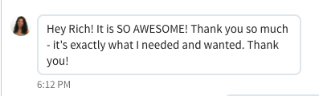
<h3>Dashboard</h3>
<p>The Calendly Zendesk Dashboard (CZD) provides a realtime visual display of each team members progress on ticket requests and completions. A photo of the team member along with two progress bars provide a visually appealing, easy-to-read display. It was laid out using Bootstrap.</p> 
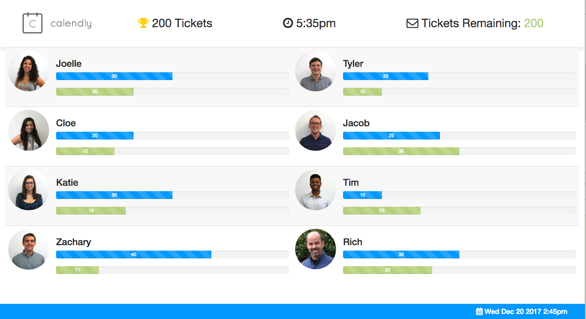
<h3>Progress Bars</h3>
<p>The bars report the number of tickets received by the member and the number of tickets completed
by the member. Each bar provides a visual, as well as numerical, description of the team members current work load so the team can be aware of the distribution of work and their individual progress.
<h3>Color Coded</h3>
The top bar, colored blue, displays the tickets received. The lower bar, colored green,
displays the tickets completed. 
</p>
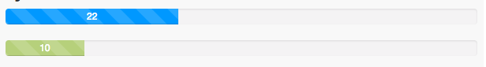

<h3>Admin Login</h3>    
<p>A separate admin panel is accessed through a login page that requires a unique user name and id.</p> 
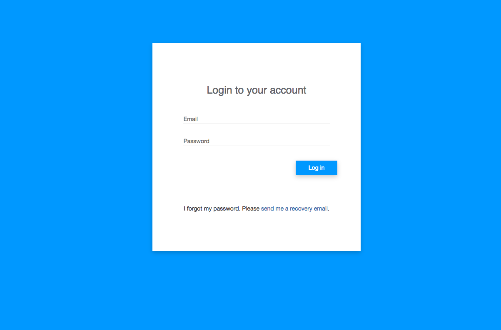

<h3>Admin Page</h3>
<p>The admin page provides the supervisor with control over various items displayed in the dashboard.</p> to a menu on the left of the
page. The menu displays the options to:</p> <ul>
<li>View Dashboard</li>
<li>Add User</li>
<li>Remove User</li>
<li>Set Goal</li>
<li>Logout</li>
</ul>


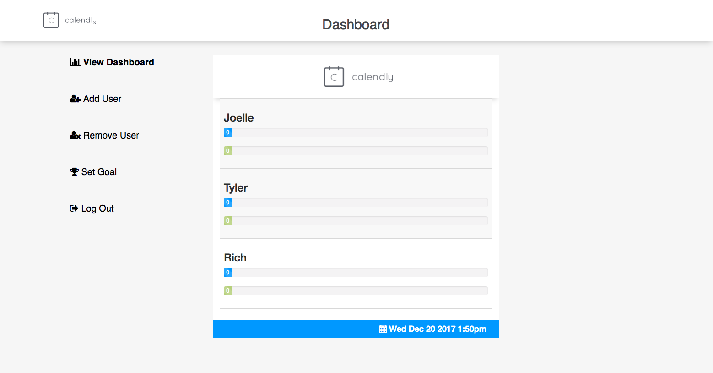
        
<h4>Add user page</h4>
<p>When adding a user, the admin will be promted to enter the team members name and a picture to use on 
the dashboard display.</p>
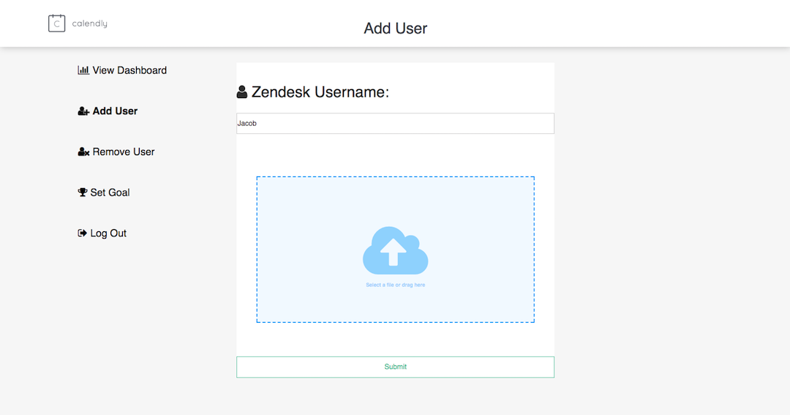
<h4>Add user picture</h4>
<p>The picture can be uploaded by browsing in Finder and selecting the appropriate
file, or drag and drop the file into the area denoted in the middle of the add user panel.
</p>
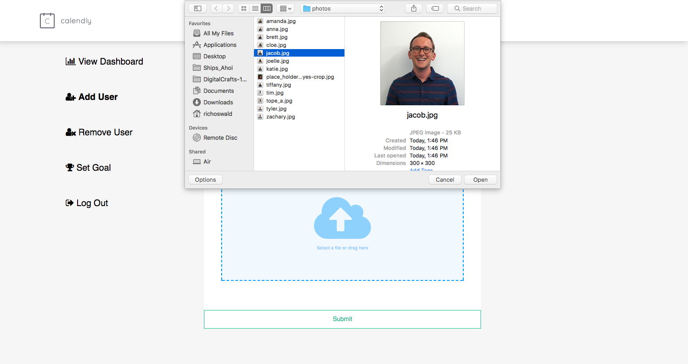
<h3>Remove User</h3>
<p>Users are removed by selecting the remove user link in the task bar which brings up the remove user screen.</p>
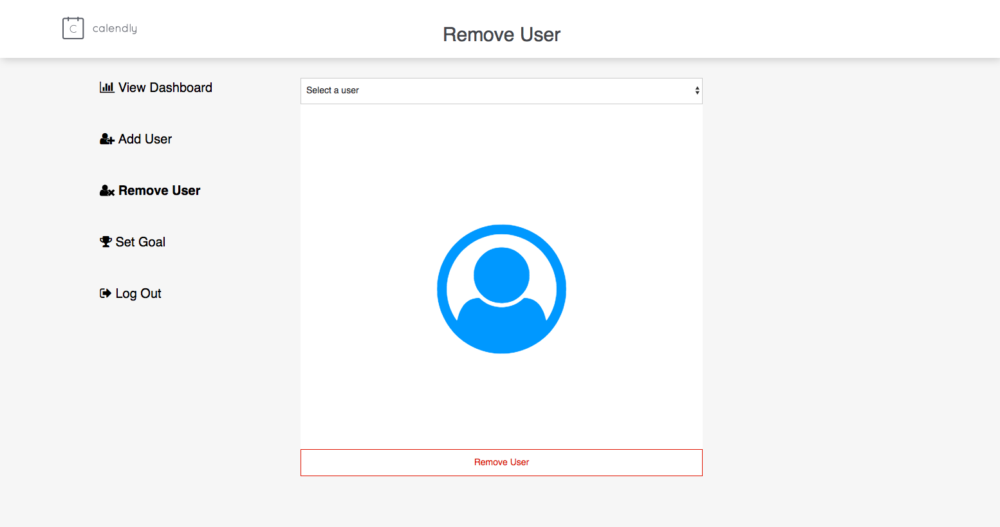            
<h3>Remove User Dropdown Menu</h3>
<p>When removing a user, a drop down menu displays all the current users. From this list, the member to delete
is selected.</p> 
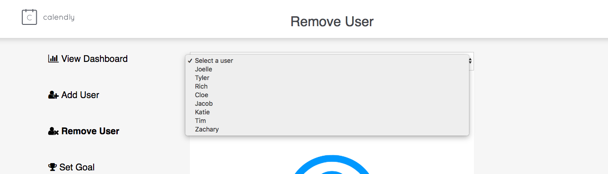
<h3>Remove User Picture Verification</h3>
<p>The current picture along with the name of the selected team member is displayed. If the
correct member has been selected, clicking the red boardered submit button at the bottom of the page will
remove the team member from the Dashboard and Admin Panel display. 
</p>


<h3>Set Goal Admin Screen</h3>
<p>To set the main goal for the team, the admin selects set goal from the dropdown menu. Then the admin can enter a value and that value will be displayed in the header of the dashboard.
</p>
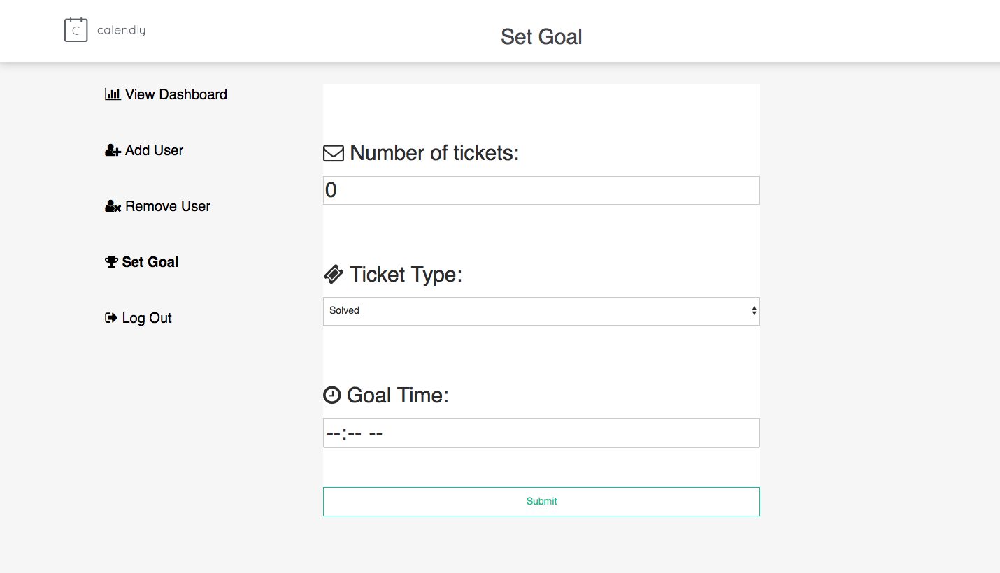   
<h3>Logout</h3>
<p>Clicking the logout button returns the admin to the admin login page and prevents viewing admin page without re-entering the correct user-name and password.</p>

<h3>Form Validation and Login Error Display</h3>
<p>There are various errors that can occur when attempting to login to the admin panel.</p>
<h3>Poorly Formatted Email</h3>
<p>If a user types in an email that does not contain the appropriate characters and section of a proper email address, this is noted with an error code in red.</p>
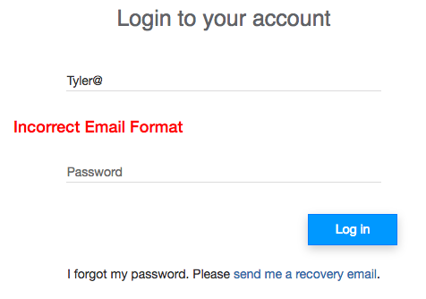
<h3>User Not Found</h3>
<p>If the user name is not found, an error code reading the same is displayed in red.</p>
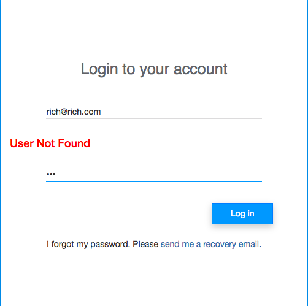
<h3>Wrong Password</h3>
<p>If there is an error in the password entered, this error is reported to the user in red.</p>
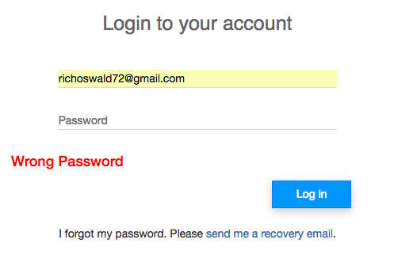
<h3>Code for above checks</h3>
<p>The code below handles the error checks that are described above. A general error reporting function is called for each error message returned by the server.</p>

``` javascript
         // General input error code reporting function
         var errorFcn = function(errorMessage) {
             var msg = document.getElementById(errorMessage);
             var emailForm = document.getElementById("email-form");
             var pwdForm = document.getElementById("pwd-form")
             var button = document.getElementById("reset-button-line");
             msg.style.display = 'block';
             button.style.marginTop = "22px";
             $(email).on('click', function(event){
                 msg.style.display = 'none';
                 emailForm.value = '';
                 pwdForm.value = '';
                 button.style.marginTop = "70px";
             });
         };
 
         // Alerts for "Invalid email", "User not found", and "Wrong password"
         promise.catch(function(error){
             if (error.code.includes("invalid-email")) {
                 errorFcn("email-error");
             }else if (error.code.includes("user-not-found")) {
                 errorFcn("user-error");
             }else if (error.code.includes("wrong-password")) {
                 errorFcn("password-error");
             };
             console.log(error.message);
             console.log(error.code);
         });
     });
```

<h3>Animation Celebrations</h3>
<p>It was requested that animations were installed that celebrated individual as well as group accomplishments for each day.</p>
<h3>Individual Goals Met</h3>
<p>When an individual support team member reaches a predetermined goal for tickets solved, a bouncing rainbow colored sheep appears above their progress bar and is translated from the far right of the bar to just in front of their name. The length of their name is calculated so the sheep stops at correct place no matter the name length. </p>
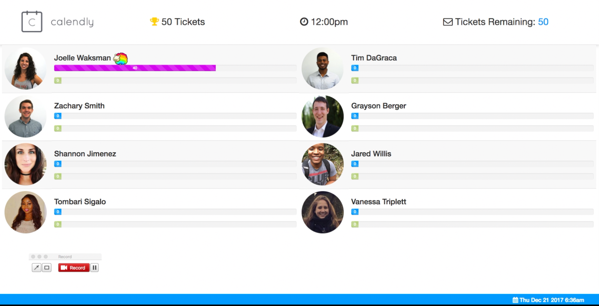

[Watch it here on YouTube](https://www.youtube.com/watch?v=l-G5I9dOWBs)

<h3>Team Goal Met</h3>
<p>There is a team goal displayed at the top of the dashboard.  When this goal is met, a large group of rainbow sheep, that takes up the verticle space of the screen, is translated from right to left across the screen.</p>


[Watch it here on Youtube](https://www.youtube.com/watch?v=Iq-ShovzZOg)

<h2>Challenges</h2>
<ul>
    <li>Back-end</li>
    <p>Since this was a full-stack project made after having gone through only front-end in class up to this point, it was quite the hurdle to learn and apply enough back-end tools to allow full functionality.
    <li>Layout</li>
    <p> Laying out the dashboard for a 60inch screen first, made making it mobile responsive a difficult endevor. 
    <li>Security</li>
    <p>Since this application was going to be used in a real world situation with proprietary data, it was important to limit access to the functionality to the team manager and make sure data was cleared each day. We did not import any historical data to limit vulnerability and complexity of data management.</p>
</ul>  
<h3>Stretch Goals</h3>
<p>The Minimum Viable Product (MVP) for this project was quite extensive. But there are several things that we would like to add and/or improve.</p>
<ul>
<li>Increase the complexity of the celebration animations.</li>
<li>Insert the ability to have ticket goals for each team member.</li>
<li>Correct the admin login text fields to clear after error is shown.</li>
<li>Add animation to the submit buttons on the "add user" and "remove user" windows on admin page to verify submission.</li>
<li>Clear the fields on "add user" and "remove user" after submission.
</ul>

<h3>We want to sincerely thank our instructor, 🏓Chris Aquino 🐱, for his kindness, availability, encouragement, knowledge and wisdom. Without him, this project would not be currently, or probably ever, used by Calendly.</p>

<h3>👏🏻-Tyler Campbell</h3>
<h3>👏🏻-Rich Oswald</h3>


